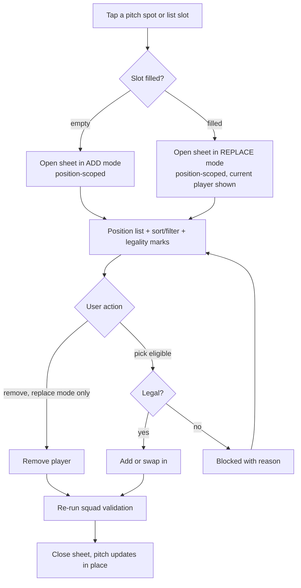

# feat: My Team pitch redesign, in-place team selection, and next-game dates

## Summary

Redesign the My Team pitch into jersey-style tokens on a green perspective field, turn every pitch spot into an in-place position-scoped selection sheet (with sort/filter, no Players-tab jump), and show each player's next-game date. All work lands in the single-file React app `src/app.jsx`, recompiled to `index.html` via `./build.sh`.

---

## Problem Frame

The current pitch is a flat set of cards and two interactions break flow: tapping an empty slot navigates away to the Players tab (losing pitch context), and the filled-token transfer path is a trimmed list rather than a smooth browse-and-choose. Nothing shows when each player next plays, which matters in World Cup fantasy — a manager may start a player who kicks off on the 11th and, after a blank, swap in a benched player who plays on the 12th. See origin: `docs/brainstorms/2026-06-10-myteam-pitch-and-selection-requirements.md`.

---

## Requirements

**Pitch visual**

- R1. The My Team pitch renders on a green perspective field that keeps the current green identity and stays legible and usable at mobile width (~360px). (origin R1)
- R2. Each selected player renders as a jersey token: one neutral jersey silhouette reused for all players, the national flag as the identifying badge, name + price in a card below, and a transfer affordance plus captain/vice (C/V) badges on the token. (origin R2)
- R3. Empty slots render as jersey-style placeholders inside the correct position rows (goalkeeper at the back, then defenders, midfielders, forwards), visually distinct from filled tokens. (origin R3)

**In-place team selection**

- R4. Tapping any pitch spot — empty or filled — opens a selection sheet on the same page and never navigates to the Players tab. (origin R4)
- R5. The sheet is pre-filtered to the tapped slot's position (tap a midfield spot, see midfielders). (origin R5)
- R6. The sheet provides sort and filter controls within it (sort by projected points, value, price, ownership, start probability; filter by price/budget and a text search), scoped to the position. (origin R6)
- R7. Each candidate's legality — affordability within remaining budget, the 3-per-nation cap, and the position quota — is visible in the sheet. (origin R7)
- R8. Selecting a candidate adds the player to an empty slot or swaps it for a filled slot, then re-runs squad validation; captaincy/vice clears if the outgoing player held it. (origin R8)
- R9. A filled slot also supports removing the player from the same sheet. (origin R9)
- R10. The Players tab continues to function as the general player browser, unchanged in behavior. (origin R10)

**Next-game date**

- R11. Each player shows the date of their team's next scheduled game (e.g., "Jun 12"), derived from the earliest upcoming fixture, on the pitch tokens, player rows, and the detail sheet. (origin R11)

---

## Key Technical Decisions

- KTD1. **Extend the existing `TransferSheet` into one unified selection sheet** rather than building a new component. It already renders a position-filtered replacement list; add an "add" mode (empty slot, no outgoing player) and keep replace + remove. One component serves both add and replace, so the pitch, the list view, and empty slots all route through it.
- KTD2. **Extract the Players-browser sort/filter/search into a shared, reusable piece** consumed by both the Players tab (`PlayersView`) and the selection sheet. Single source of truth avoids the two surfaces drifting. The Players tab's observable behavior must stay identical after extraction.
- KTD3. **Pitch perspective via CSS, subtle not strong.** Build the field with a CSS trapezoid/perspective transform plus line markings and a green gradient, keeping tokens visually upright and legible. A strong official-style 3D tilt is rejected because it crushes readability at narrow widths (R1).
- KTD4. **Generic jersey is a CSS shape, flag is the badge.** One jersey silhouette reused for all players, with the existing flag emoji as the identifying crest; reuse the current C/V badge and transfer-affordance styles for the chrome.
- KTD5. **The selection sheet shows the full position list with legality marked, not a pre-trimmed eligible-only list.** Over-budget / nation-cap / quota-blocked candidates are shown but clearly not selectable (with the reason), giving the "good list" browse feel while preventing illegal picks (R7).
- KTD6. **Next-game date = earliest upcoming scheduled fixture from `fixtures[squadId]`**, formatted like the existing "Jun 12" (`toLocaleDateString` month/day). Date only — no kickoff time or opponent.
- KTD7. **Verification without a test framework.** The repo has no test runner; verify with `./build.sh` plus a jsdom render-smoke of the built `index.html` (the approach already used in this codebase) and manual checks against the acceptance examples. No test framework is introduced.

---

## High-Level Technical Design

The selection interaction is the load-bearing flow — one sheet, branching on slot state and candidate legality:

---

## Implementation Units

### U1. Pitch visual redesign

- **Goal:** Replace the current flat pitch tokens with jersey-style tokens on a green perspective field carrying the official-style chrome.
- **Requirements:** R1, R2, R3
- **Dependencies:** none
- **Files:** `src/app.jsx` (`Pitch`, `PitchToken`, and the `css` template); rebuild `index.html` via `./build.sh`. No test file (no test runner) — verified via render-smoke + manual.
- **Approach:** Restyle `.pitch` into a green perspective field (CSS transform/clip-path trapezoid, center circle and penalty-box line markings, green gradient retaining `--pitch`/`--pitchbg`). Rebuild `PitchToken` as a jersey silhouette (CSS shape) with the flag emoji as the crest, name + price card below, and the existing transfer/C/V chrome positioned on the token. Keep tokens upright and legible; the perspective lives on the field, not the tokens. Empty slots become jersey-style dashed placeholders within their position rows (FWD/MID/DEF rows above, GK at the back).
- **Patterns to follow:** existing `.ptok`, `.ptok.empty`, `.ptok-cv`, `.cap`/`.vc`, `.fixdot` classes and the `--pitch`/`--pitchbg` CSS variables; existing row ordering in `Pitch` (`FWD, MID, DEF, GK`).
- **Test scenarios:**
  - Render-smoke: My Team mounts; pitch renders the four position rows with GK row last; filled tokens show flag, name, price.
  - Render-smoke: a seeded captain/vice show C and V badges on their tokens. Covers part of AE-prep for later units.
  - Manual: at a 360px viewport the field reads as a green pitch and token text is fully legible (R1).
- **Verification:** `./build.sh` succeeds; render-smoke passes; visual check at narrow width confirms legibility and the green perspective look.

### U2. Extract shared sort/filter/search

- **Goal:** Make the Players-browser sort/filter/search reusable so both the Players tab and the selection sheet use one implementation.
- **Requirements:** Supports R6, R10
- **Dependencies:** none
- **Files:** `src/app.jsx` (`PlayersView` and a new shared filter/sort helper or small component); rebuild `index.html`. No test file — verified via render-smoke + manual parity check.
- **Approach:** Lift the filtering/sorting logic (and, where it helps, the controls UI) out of `PlayersView` into a reusable function/component parameterized by the candidate list and an optional locked position. `PlayersView` consumes it with no behavior change; the selection sheet (U3) consumes it position-locked.
- **Execution note:** Verify Players-tab parity after extraction — same filters, same sort options, same results ordering as before.
- **Patterns to follow:** the existing `useMemo` filter/sort in `PlayersView` (`q`, `pos`, `grp`, `maxP`, `sort`, `cnt` state and the `key`-based sort).
- **Test scenarios:**
  - Render-smoke: Players tab still lists 60 rows by default and changing the sort reorders them.
  - Render-smoke: position and price filters and text search still narrow the list as before.
  - Manual: spot-check that the Players tab is visually and behaviorally unchanged (R10).
- **Verification:** Players tab behaves identically to pre-refactor; the shared piece is importable by U3.

### U3. Unified in-place selection sheet

- **Goal:** Turn every pitch spot (and list slot) into an in-place, position-scoped selection sheet with sort/filter that adds, replaces, or removes — never jumping to the Players tab.
- **Requirements:** R4, R5, R6, R7, R8, R9
- **Dependencies:** U1, U2
- **Files:** `src/app.jsx` (`TransferSheet` extended into the selection sheet; `App` add/select handlers and state; `Pitch`/`PitchToken` `onToken`/`onEmpty` wiring; `MyTeam` list-slot wiring); rebuild `index.html`. No test file — verified via render-smoke + manual against AEs.
- **Approach:** Give the sheet two modes: replace (an outgoing player is present — current behavior) and add (no outgoing player, opened from an empty slot of a given position). Eligibility base cost is the full squad cost in add mode and `squad cost − outgoing price` in replace mode; nation and quota checks account for the slot being filled. Render the full position list with sort/filter from U2 and per-candidate legality marks (over-budget / at nation cap / quota full) per KTD5; picking an eligible candidate adds or swaps and re-runs validation; replace mode also exposes remove. In `App`, route empty-slot taps to open the sheet for that position instead of `goPlayers`; wire filled tokens and list slots to open it for the tapped player.
- **Patterns to follow:** existing `TransferSheet` eligibility filter and bottom-sheet layout; `App.swap`/`App.toggle`/`persist` for squad mutation and validation; existing C/V clearing on swap.
- **Test scenarios:**
  - Covers AE1. Tap an empty midfield slot -> a sheet opens listing midfielders with sort/filter; the Players tab is not opened.
  - Covers AE2. Tap a filled forward token -> sheet opens scoped to forwards with the current player marked and replace + remove available.
  - Covers AE3. Change the sort to Value inside the open sheet -> the list reorders within the sheet without leaving the pitch.
  - Covers AE4. A candidate that would exceed budget or the 3-per-nation cap is shown but not selectable, with the reason, and applying it is prevented.
  - Add validation: adding to an empty slot respects budget, position quota, and 3-per-nation.
  - Swap clears captaincy: transferring out the captain leaves the squad with no captain (not auto-reassigned).
- **Verification:** all five acceptance examples pass via render-smoke/manual; no path from a pitch spot reaches the Players tab; swaps and adds always leave a valid squad.

### U4. Next-game date on players

- **Goal:** Show each player's next-game date on pitch tokens, player rows, and the detail sheet.
- **Requirements:** R11
- **Dependencies:** U1
- **Files:** `src/app.jsx` (a `nextFixture(squadId, fixtures)` helper; render in `PitchToken`, `PlayerRow`, `Detail`); rebuild `index.html`. No test file — verified via render-smoke + manual.
- **Approach:** Compute the earliest upcoming scheduled fixture from `fixtures[squadId]` and format it like the existing fixture dates ("Jun 12"). Render it on the jersey token (under price/proj), in the player-row meta line near the fixture dots, and in the detail sheet near the NEXT chip. Degrade gracefully when a team has no upcoming fixture (show nothing or a dash).
- **Patterns to follow:** existing `new Date(f.date).toLocaleDateString(undefined,{month:"short",day:"numeric"})` formatting in `FixtureStrip`/`Detail`; `fixtures[squadId]` shape from `buildModel`.
- **Test scenarios:**
  - Covers AE5. A player whose team next plays June 12 shows "Jun 12" on the pitch token, the player row, and the detail sheet.
  - Edge: a player whose team has no remaining scheduled fixture renders without error (no date or a dash).
- **Verification:** the next-game date appears on all three surfaces and matches the team's earliest upcoming fixture.

---

## Acceptance Examples

- AE1. **When** the manager taps an empty midfield slot, **then** a position-scoped midfielder sheet opens and the Players tab is not opened. **Covers R4, R5.**
- AE2. **When** the manager taps a filled forward token, **then** the sheet opens scoped to forwards with the current player marked and replace + remove available. **Covers R5, R8, R9.**
- AE3. **When** the manager changes the sort to Value inside the open sheet, **then** the list reorders within the sheet without leaving the pitch. **Covers R6.**
- AE4. **When** a candidate would exceed the budget or the 3-per-nation cap, **then** the sheet shows it as not selectable (with the reason) and applying it is prevented. **Covers R7, R8.**
- AE5. **When** a player's team next plays June 12, **then** "Jun 12" appears on their pitch token, player row, and detail sheet. **Covers R11.**

---

## Scope Boundaries

- Real or licensed national-team kit images — excluded (IP sensitivity, no assets).
- Per-team jersey color tinting — excluded; one generic jersey for all.
- Heavy 3D / WebGL / animated pitch — excluded; CSS perspective only.
- A starting-XI vs bench / formation system — excluded. The app treats the 15 as one squad; the next-game date supports the manual timing tactic without building formation management.

### Deferred to Follow-Up Work

- Kickoff time and opponent on the next-game chip, and an automated bench-timing assist (sort/flag bench players by kickoff). The data carries kickoff datetimes, so these are feasible later; deferred per the brainstorm's date-only decision.

---

## Risks & Dependencies

- **Perspective readability (R1).** A perspective field can hurt legibility on narrow screens. Mitigate by keeping the perspective subtle and tokens upright; verify at ~360px (U1).
- **Players-tab regression (U2).** Extracting shared sort/filter could change Players-tab behavior. Mitigate with the parity check in U2's execution note.
- **No automated test harness (KTD7).** Verification relies on build + render-smoke + manual checks, so regressions can slip. Mitigate by scripting the render-smoke assertions for the acceptance examples.
- **Visual quality of a CSS jersey (KTD4).** A CSS/emoji jersey is a compromise versus real kits; keep the shape simple and verify visually.
- **Fixture data dependency (R11).** `fixtures[squadId]` covers group games (rounds 1-3); knockout fixtures are not present pre-tournament. Next-game shows the earliest group game, which is correct for the current stage.

---

## Sources / Research

All references are in `src/app.jsx` (single-file React app compiled to `index.html` by `build.sh`):

- `Pitch`, `PitchToken` — current pitch rendering and token layout (U1).
- `TransferSheet` — existing position-filtered swap sheet; the base to extend into the unified add/replace/remove selection sheet (U3).
- `PlayersView` — sort/filter/search state and `useMemo` logic to extract and reuse (U2).
- `App` (`toggle`, `swap`, `persist`, and the validation inside `toggle`) — squad mutation and the budget/quota/nation rules the sheet must respect (U3).
- `buildModel` — produces `fixtures[squadId]` with per-fixture `date`; source for the next-game date (U4). `FixtureStrip`/`Detail` show the date-formatting pattern to mirror.
- `CLAUDE.md` — constraints: not affiliated with FIFA, avoid licensed assets; mobile-first; keep the light design language.
- Verification approach: no test runner in the repo; use `./build.sh` plus a jsdom render-smoke of the built `index.html` and manual acceptance-example checks (KTD7).
